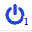
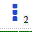
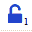
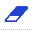
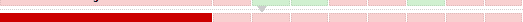

## [Vrooboo! Wabbo!!](https://umatrix-rules.github.io/#ovagarava---toc)
### uMatrixパネルの要素を説明します

 このサイトの臨時スイッチ（新規臨時規則 `matrix-off: example.com true` ）。下付き数字はドメイン名のカウントです。

 プライバシーツールのスイッチ。グローバル設定はuMatrixコンソールの設定タブにあります。下付き数字はこのサイトでアクティブの工具量。

 すべての臨時規則を保存、臨時規則が存在する場合のみで選択することができます。下付き数字は保存待ちの臨時規則の量。

 すべての臨時規則を削除、臨時規則が存在する場合のみで選択することができます。

 クリックすると、組み込みの受信傍受ドメイン名（コンソールの[ドメインファイル]タブ）が展開または折りたたまれます。これらのドメインが下部に現れないことがあります、例えば `pingjs.qq.com`，この状況は `永久规则`を表示します。

---

`赤い四角形（またはカラーブラインドモードの青色の四角形）`：ブロックされたコンテンツ。

`緑色の四角形（またはカラーブラインドモードの黄色の四角形）`：許可されたコンテンツ。

`ライトカラーの四角形`：全域規則。

現在のサイトでは、上記の3つのタイプのいずれかで、ボックスの上半分をクリックして対応する要素を許可し、下半分をクリックしてブロックします。

`ダークカラーの四角形と小さな三角形`：このサイトの永久規則。

- `暗赤色の四角形（またはカラーブラインドモードの暗い青色の四角形）`：上半分をクリックすると許可することができますが、対応する要素はグローバルルールによってブロックされている可能性があります。
- `暗緑色の四角形（またはカラーブラインドモードの暗い黄色の四角形）`：下半分をクリックして許可するができます。

`ダークカラーの四角形（小さな三角形なし）`：このサイトの臨時規則。

### Reeshoova! - 使用許諾契約
テキストは <a rel="license" href="http://creativecommons.org/licenses/by-nc-sa/4.0/">CC BY-NC-SA 4.0 International License</a>
の下で利用可能です。追加の条件が適用される場合があります。
